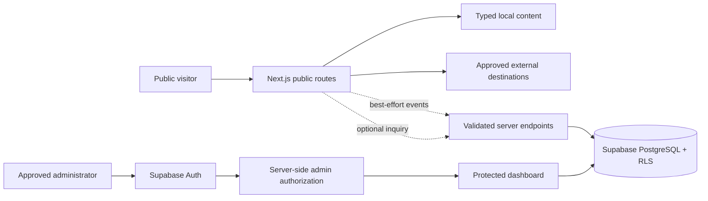
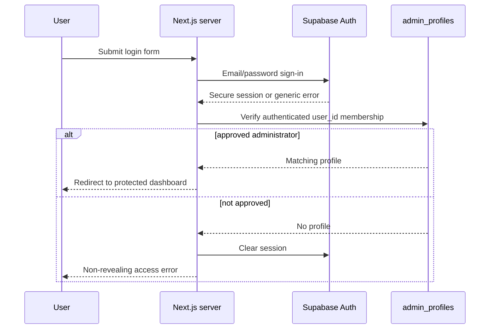
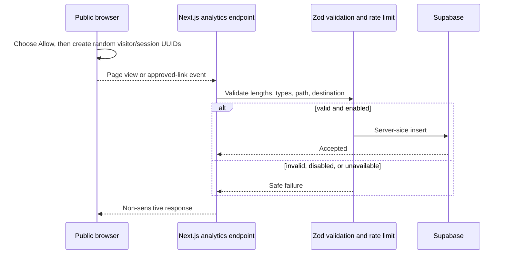
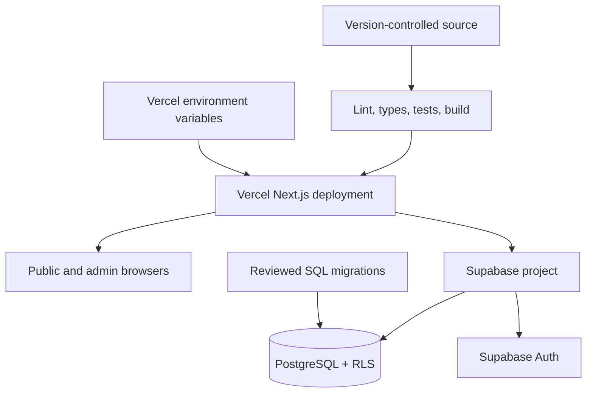

# Architecture

## Status and scope

This document defines the architecture and records the verified implementation through Phase 12 plus the 2026-08-10 administrator and analytics activation. The Next.js 16 public experience is published from GitHub and deployed to Vercel with a verified HTTPS canonical origin, Node 22, restricted production configuration, privacy-safe metadata, WCAG-oriented interaction safeguards, and restrictive response headers. The ordered deny-by-default Supabase schema, layered administrator authorization, consent-based analytics, protected reporting, and analytics-only retention are operational in production. Optional public inquiry submission remains disabled; its administrator route and protected export boundary are implemented but no live inquiry workflow is claimed.

## Implemented foundation

- The App Router document shell is a Server Component with an English document language, canonical/social/robot metadata, global CSS, and a keyboard skip link.
- The root route is a statically renderable public homepage; its feature sections are composed as Server Components.
- Global semantic color/design tokens and reduced-motion defaults are available to later components.
- Reusable button, card, container, and skip-link primitives compile under strict TypeScript.
- Accessible loading, not-found, and non-revealing error states exist at the application root.
- Vitest covers the shared class utility; Playwright covers unauthenticated root access, mobile overflow, skip-link behavior, the 404 route, the shared shell, and homepage content safeguards.
- Exact dependencies are locked. The audited application uses Next.js 16.2.12, and narrow PostCSS/Sharp/brace-expansion resolutions keep both production and complete dependency audits clean; the rationale is in `DECISIONS.md`.

## Implemented public shell

- `src/app/(public)/layout.tsx` composes a shared header and footer without coupling future administrator routes to the public chrome.
- Editable local SVG assets provide full dark/light logos, dark/light marks, and a simplified favicon with no remote references. Apple and web-app PNG icons are exact mechanical renders of the emblem.
- Header, mobile menu, and footer consume one typed navigation source. Only implemented routes are links; future destinations remain visibly and programmatically disabled.
- The mobile menu is a focused Client Component with a labelled modal dialog, initial focus, focus trapping, Escape handling, focus restoration, close-after-navigation, and body-scroll cleanup.
- Validated owner-configured external destinations render through one consent-aware tracked anchor; incomplete/malformed values remain disabled with explicit reasons. Production supplies the approved booking, social, messaging, map, telephone, and email destinations through environment configuration rather than source.
- Footer copy contains only the confirmed address, a measured property description, booking-link status, and independent-site disclaimer. Private caretaker and unapproved owner contacts remain absent.
- Automatic prefetch is disabled on the current public navigation because concurrent development prefetch provided no benefit and triggered a Next router initialization warning.

## Implemented homepage

- `src/app/(public)/page.tsx` composes eleven focused homepage sections without adding client-side JavaScript.
- `src/data/site.ts`, `accommodation.ts`, `amenities.ts`, `gallery.ts`, `reviews.ts`, `location.ts`, and `attractions.ts` centralize the public facts, qualifications, excerpts, and inactive destination states used by those sections.
- The hero, summary, About anchor, accommodation, amenities, gallery, reviews, location anchor, attraction preview, and closing call to action are public without authentication.
- Approved local Villa Vessela photography now supplies the public photo-led sections with accurate alternative text, qualified captions, responsive sizing, and privacy-reviewed crops. Blue Kubo, Green Kubo, and parking retain three explicit reserved slots rather than invented media.
- Confirmed standard capacity is distinct from conditional expanded capacity; the bathroom arrangement, frying-kubo access, connectivity, tour conditions, and map/booking availability retain explicit limitations.
- Booking, review-destination, and map controls fail closed until complete approved URLs exist. Production supplies the approved booking and map destinations through validated environment configuration, using the same exact destination allowlist as server analytics.
- Responsive `next/image` usage, semantic landmarks/headings, keyboard-reachable anchors, sufficient contrast, and an automated full-page Axe scan are covered by the Phase 3 QA suite.

## Implemented public information routes

- `/accommodation` presents the standard capacity, supplied spaces/facilities, conditional expanded capacity, reported bathroom details, and explicit non-assumptions for the kubos and beach cottage.
- `/amenities` groups beach/outdoor, comfort, and kitchen information. Each item carries a text-and-icon certainty label; mobile connectivity is separated from fixed Wi-Fi, and optional services retain availability/fee warnings.
- `/guest-guide` owns arrival/departure, packing, self-catering, local shopping, water/connectivity, house rules, fees, nearby attractions, and native `
` FAQs. House rules, fees, attractions, and FAQs use anchors rather than undocumented top-level routes.
- `guestGuide.ts`, `houseRules.ts`, `fees.ts`, and `faqs.ts` extend the focused data layer. FAQ answers import canonical qualifications where practical instead of re-deciding them.
- Draft fee-source values are centralized for reconciliation but never rendered. The public page displays only an owner-confirmation-required status and a generic confirmation message.
- All three pages are Server Components with route metadata, one level-one heading, breadcrumbs, working internal navigation, no authentication requirement, and no active unverified external link.
- Phase 4 Playwright coverage checks public access, content safeguards, mobile overflow, focus/menu behavior, native FAQs, anchor navigation, metadata structure, and zero Axe violations on each route.

## Implemented discovery and contact routes

- `/gallery` presents the source-requested categories with approved local photography plus three explicitly reserved future slots. A focused Client Component supplies dialog semantics, initial focus, focus trapping/restoration, body scroll locking, Escape and arrow-key behavior, previous/next controls, loading feedback, and image-error fallback.
- `/reviews` presents the supplied 4.76/5 aggregate, 21-review count, six category scores, and three attributed Airbnb excerpts. Three separate Messenger positions contain no invented quote, identity, rating, or screenshot.
- `/location` presents the confirmed text address and supplied approach directions. A Client Component copies only that address and offers opt-in zoomable Google Maps or Waze for one verified pin; no iframe loads before provider choice and both tracked navigation actions remain usable without device geolocation.
- `/contact` renders six supported contact channels through validated public configuration. Missing values remain inactive. Its inquiry form is a server-selected, default-disabled feature: disabled mode preserves the safe no-action preview, while enabled mode uses the separately validated Phase 10 endpoint and never asks for payment-card data.
- `/privacy` accurately describes explicit analytics choice, browser identifiers/storage, analytics-only daily 365-day retention, optional inquiries, approved-administrator access, external destinations, provider boundaries, and the configured Contact request route. It makes no legal-compliance claim and exposes no guessed privacy contact.
- Gallery, Reviews, Location, and Contact are active internal routes, while every unverified external destination remains a non-link. Playwright covers public access, metadata, focus/keyboard behavior, copy behavior, inactive destinations, mobile overflow, disabled/enabled form behavior, and zero Axe violations on all four pages.

## System overview

Villa Vessela has two deliberately separated experiences:

1. A public, mobile-first information and referral website that never requires guest authentication.
2. A protected administrator application for anonymous aggregate analytics and optional inquiries.

Public content is sourced from typed local data modules. External destinations are normalized from public configuration and remain inactive until verified. Browser analytics and optional inquiries pass through separate validated server endpoints. Public clients receive no database read/write access.

## Public website architecture

- Next.js App Router route group for `/`, `/accommodation`, `/amenities`, `/gallery`, `/reviews`, `/location`, `/guest-guide`, `/contact`, and `/privacy`.
- React Server Components by default; Client Components only for browser-dependent behavior such as the mobile menu, lightbox, copy action, forms, and analytics dispatch.
- Central typed content files prevent property facts from being duplicated across components.
- Configured external actions use a reusable tracked-link component. Missing or invalid destinations produce non-active UI rather than guessed URLs.
- `next/image`, responsive sizes, deliberate crops, and lazy loading serve the approved local photography; clearly labelled reserved slots remain only where the owner has not supplied Blue Kubo, Green Kubo, or parking media.
- Analytics and Supabase failure must not make public content or outbound navigation unusable.

## Administrator dashboard architecture

- `/admin/login` is the only unprotected admin route.
- Other `/admin/*` routes require a valid Supabase session and a matching `admin_profiles` row checked on the server.
- Dashboard reads use the request-scoped authenticated client and remain subject to RLS; the service-role client is not imported.
- Today, last-7-day, last-30-day, current-month, and custom filters resolve to one validated start-inclusive/end-exclusive UTC interval from Asia/Manila calendar days. Custom periods reject malformed, reversed, future, and longer-than-366-day inputs before querying.
- Migration `007` exposes five authenticated-only `SECURITY INVOKER` functions for exact summary, daily, device, link, and top-page aggregates. CTR intersects link-clicking IDs with page-view visitor IDs and returns zero for a zero denominator.
- Six summary cards, nine link-category cards, five Recharts views, and three 15-row recent-activity tables use the same range. Only aggregated chart props cross the Client Component boundary; full event IDs, inquiry messages, contact values, destination URLs, and consent values do not.
- An authenticated operational-status panel distinguishes collection disabled, write configuration absent, reporting unavailable, configured/no stored data, and stored activity. It displays only boolean configuration readiness plus safe last-event timestamps and provides an explicit server refresh; it never exposes or uses the backend secret for reads.
- `/admin/inquiries` selects at most 20 protected records per page, allowlists status/page filters, renders contact/message details only in the dynamic protected response, and exposes only a status allowlist to the update Server Action. The action repeats administrator authorization and RLS before updating the `status` column.
- `/admin/exports/[type]` repeats authorization inside the handler, allowlists three export types, reuses the validated dashboard date range, reads through the authenticated RLS client, paginates in 1,000-row batches, and stops at 10,000 records.
- Recharts are confined to the protected dashboard route, disable animation, and pair every visual with an expandable HTML data table. Empty charts retain explicit textual states.
- Synthetic seed markers produce a visible demonstration-data notice. Database failures are distinct from successful empty results, and route-level loading/unexpected-error states reveal no technical detail.

## Authentication and authorization flow

Authentication proves identity; it does not by itself grant administrator privileges.

`src/proxy.ts` matches `/admin/*` only. It uses `auth.getClaims()` early in the request to verify/refresh a cookie session, propagates refreshed cookies to the request and response, and redirects unauthenticated protected requests to the fixed `/admin/login` path. It is an optimistic request boundary, not the authorization authority. The protected layout calls `getAdminAccess()`, which uses `auth.getUser()` for a fresh server-verified identity and queries the RLS-protected `admin_profiles` row before rendering. Login repeats the profile check before redirecting to the dashboard.

No public registration or arbitrary return URL is created. Administrator users and `admin_profiles` membership are provisioned manually through approved backend procedures. Auth responses use one generic account/approval error; configuration/service failures expose no technical detail. Administrator pages are dynamic, `noindex`, and private/no-store in production. Supabase cookies use one consistent SameSite=Lax policy and the Secure attribute in production.

## Analytics flow

- Analytics is enabled only when `ANALYTICS_ENABLED` is exactly `true`; production currently uses true. Changing its build-time value requires a rebuild of the static public layout.
- Before a visitor chooses **Allow analytics**, and whenever the visitor declines or the feature flag is false, the client creates no analytics identifier or request. A persistent settings control allows later changes; failed preference storage fails closed and removes any stale Allow state.
- Visitor IDs are random first-party UUIDs in a 365-day SameSite=Lax cookie with `Secure` on HTTPS. They are not derived from personal/device characteristics.
- Session IDs are separate random UUIDs in `sessionStorage` and rotate after 30 minutes of inactivity.
- Page views emit only an allowlisted public pathname, origin-only referrer, and coarse device/browser categories. Link clicks emit the normalized source path, reviewed category, and exact owner-approved public destination; that destination can contain the intentionally public property pin or configured public contact. No visitor-supplied identity/contact field, query, hash, raw user agent, screen property, raw IP, visitor/device geolocation, fingerprint, or cross-site history is stored.
- `PageViewTracker` exists only in the public route group, keeps one last-path ref to suppress rerender duplicates, and records a new event when navigation changes the pathname.
- `TrackedExternalLink` preserves native anchor behavior. It uses `sendBeacon` where suitable and `fetch(..., { keepalive: true })` as fallback without waiting or preventing navigation.
- Both handlers reject cross-origin browser requests, accept POSTed JSON no larger than 4 KiB, use strict Zod schemas, reject admin/unknown paths, require exact normalized destination matches, and emit private/no-store responses.
- Bounded per-visitor and global fixed windows temporarily keep only random IDs in process memory. No IP is retained. This is not globally atomic across serverless instances, so a privacy-compatible distributed/WAF limiter remains a documented hardening item for sustained or adversarial traffic.
- Valid events insert through the isolated plain `supabase-js` privileged client. Missing storage or insert failure produces one payload-free warning per event/reason and a safe response; the browser ignores delivery failures.

## Database architecture

Implemented core relations:

- `admin_profiles`: approved Supabase user IDs, display names, roles, timestamps.
- `page_views`: anonymous visitor/session identifiers, normalized path, coarse client context, timestamp.
- `link_clicks`: anonymous visitor/session identifiers, enumerated link type, approved destination, source page, timestamp.
- `contact_inquiries`: voluntarily supplied contact data, preferred dates, guest count, consent, status, timestamp.

All tables have RLS enabled in migration `004`; direct `anon` and `authenticated` privileges are revoked before later grants. Migration `005` uses a private, stable `SECURITY DEFINER` helper with an empty search path to verify `auth.uid()` membership in `admin_profiles`. Approved administrators receive reads and only the `status` column update on inquiries. There is deliberately no direct public insert policy: analytics and inquiry handlers validate and rate-limit before using the server-only Supabase client. The modern backend secret maps to a full-privilege role that bypasses RLS; least privilege is therefore enforced by secret isolation and the narrow validated route usage, not by claiming the credential itself is insert-only. Administrator-profile provisioning remains out of band.

Migration `006` adds four `security_invoker` daily views for overview, path, device, and link-click aggregates using Asia/Manila dates, so base-table RLS still governs access. Migration `007` adds five bounded `SECURITY INVOKER` dashboard functions, revokes default/anon execution, and grants execution only to authenticated callers whose base-table reads still pass administrator RLS. Migration `008` adds distinct `waze` link categorization plus a private, parameterless analytics-only pruning routine and one daily Supabase Cron job. Date, visitor, session, path, link-type, and status indexes support bounded reports. The schema and functions are mirrored in `src/types/database.ts` and reconciled through migration/schema/type tests.

`src/lib/supabase/client.ts` and `server.ts` use the anon key and remain subject to RLS. `proxy.ts` is also anon-key based and cannot grant administration. `service.ts` is server-only and is used only after independent analytics or inquiry validation; administrator reads/updates/exports never import it. Supabase URLs require HTTPS (or documented local HTTP); missing configuration returns `null`, keeping public rendering independent of storage. Local CLI configuration disables email/SMS/general signup; administrator creation/profile provisioning is manual and never seeded.

Static tests verify ordering, migration documentation, constraints/indexes, RLS statements, policy/grant shape, security-invoker views/functions, range guards, least-privilege dashboard queries, and synthetic seed safeguards. Migrations `001` through `008` replayed successfully in local Docker QA and are applied to the linked production project; local/linked lint returned no findings. Live anonymous, approved, and authenticated-unapproved RLS behavior, one consented page-view/link-click pair, authenticated dashboard/RPC/CSV reconciliation, and exact synthetic cleanup passed on 2026-08-10. Inquiry insertion/status/export remains outside that live activation proof because inquiry submission is disabled.

## Contact-inquiry flow

Inquiry publication and collection use separate fail-closed server boundaries. With `CONTACT_INQUIRY_VISIBLE` false/absent and collection disabled, unfinished inquiry content is omitted from public Contact/Privacy and administrator navigation/dashboard/routes/exports. With visibility true and collection false, the reviewed disabled form and retained-record privacy/admin rollback surfaces remain available. `CONTACT_INQUIRY_ENABLED=true` always implies visibility and alone enables the dynamic form plus `/api/contact`; the disabled endpoint returns private/no-store `404` regardless of visibility.

When enabled, a small Client Component submits JSON no larger than 8 KiB with a random session-scoped form client UUID. Zod sanitizes and bounds name/contact/message fields, requires at least one contact method plus consent, accepts either an ordered valid date pair or neither, bounds guests to 1–20, rejects past/over-two-year check-ins and Luhn-valid payment-card patterns, and never stores the client UUID. Same-origin checks, a hidden honeypot, two-second minimum/one-day maximum fill time, a three-per-hour client window, and 60-per-minute global window provide layered abuse resistance without retaining raw IP.

Only validated requests enter the isolated service-role insert. A honeypot decoy receives a non-storing 202; a real insert receives 201. Missing/failing storage receives 503 and the form retains guest entries, so failure is never disguised as success. Logs contain fixed reasons only.

Public users receive no read route. Protected administrator reads and status updates use the authenticated request client plus RLS. Inquiry email/phone/message values stay out of Client Component props except the status-only form's framework-encrypted action binding.

## CSV export flow

The dashboard presents fixed links for page views and link clicks, and adds inquiries only after the inquiry surface is published, using its selected Asia/Manila dates. The protected handler rejects hidden/unknown types, invalid dates, and unauthenticated/unapproved/unavailable callers. It returns attachment/no-store/nosniff/no-referrer headers and fixed filenames. Every cell is quoted, embedded quotes are doubled, formula-like values are prefixed, and output uses UTF-8 BOM plus CRLF. Exports omit database IDs, session IDs, and destination URLs; inquiry exports necessarily contain voluntary contact/message data and must be handled as private.

## SEO, accessibility, and performance architecture

`NEXT_PUBLIC_SITE_URL` passes one canonical-origin parser: production indexing requires public HTTPS with no credentials, path, query, or fragment. Missing, unsafe, local, or reserved `.invalid` values fall back to a local origin and emit `noindex` metadata plus a disallow-all robots file. A valid production origin enables public crawling while still excluding `/admin/` and `/api/`.

All nine public pages have unique titles/descriptions, canonical URLs, Open Graph/Twitter metadata, one level-one heading, and JSON-LD. The homepage emits a conservative `LodgingBusiness` graph containing only the short name, confirmed address, standard occupancy, confirmed room/bath counts, supplied amenities, and supplied aggregate rating. Inner-page visible breadcrumbs share their facts with `BreadcrumbList`. JSON-LD escapes `<`. Reserved images, exact coordinates, map/contact destinations, prices, expanded capacity, and unconfirmed structures/amenities are omitted. Google `VacationRental` rich-result markup remains deferred until the owner approves a stable property identifier, verifies current eligibility/required structured fields, and approves the exact photograph set for that use.

`sitemap.ts`, `robots.ts`, `manifest.ts`, and `opengraph-image.tsx` are static metadata routes. The share image uses the approved local Villa Vessela photo-wall photograph with an accessible property-specific description. The manifest references inspected 192/512 PNG renders and root metadata references a 180 Apple icon plus the SVG favicon.

Accessibility uses semantic landmarks, one H1, visible/structured breadcrumbs, labels and status messages, text-plus-color availability states, focus trapping/restoration for dialogs, chart tables, a skip link, six-rem focus scroll clearance, a two-color focus indicator, forced-color fallback, reflow-safe long text, and reduced-motion CSS. Axe covers every public page plus the login; browser tests cover keyboard dialogs, form feedback, mobile overflow, focus visibility, and reduced motion.

Public informational routes remain static except runtime-flagged Contact. System fonts add no font request. Local images use `next/image`, intrinsic/responsive sizing, eager loading only for the hero/brand, and labelled local placeholders. Gallery and Recharts Client Components remain route-scoped; production inspection found no dashboard/Recharts marker in homepage, Gallery, Privacy, or login script responses. Public logo/image assets receive one-day cache freshness with one-week stale revalidation. Database reporting stays range-bounded, aggregate-first, and paginated.

## Security architecture

- Server-side authorization protects data and routes; hidden navigation is never treated as a security boundary.
- Supabase migrations enable RLS on every application table; anonymous, authenticated-unapproved, and approved-administrator behavior has been tested against the linked production database.
- The full-privilege backend secret is server-only, is scoped to Vercel Production, and never uses a `NEXT_PUBLIC_` prefix. Administrator reporting remains on the authenticated RLS client rather than this secret.
- Every route receives a CSP, clickjacking denial, MIME-sniffing denial, strict referrer policy, restricted browser capabilities, opener/resource isolation, and cross-domain-policy denial. Production adds two-year HSTS, upgrade-insecure-requests, and removes development-only `unsafe-eval`.
- CSP permits only same-origin scripts/resources plus the inline script/style behavior required by current Next.js rendering, JSON-LD, responsive images, and charts; no third-party script origin is allowed.
- External-link event destinations are matched against the approved configuration, not accepted from arbitrary request bodies.
- Auth, analytics, and inquiry inputs have strict schemas, length limits, normalization or sanitization, non-revealing errors, and bounded abuse protection.
- Administrator redirects are fixed safe internal paths; untrusted return destinations are ignored.
- Administrator responses are noindex and private/no-store in production. Supabase SSR cookies use SameSite=Lax and production Secure attributes; the library's browser-compatible session cookies are not misrepresented as HTTP-only.
- Secrets, private phone numbers, raw IPs, visitor/device GPS, and invasive identifiers do not enter browser bundles or repository source. The approved public property pin is a separate content destination, not visitor geolocation.
- The site remains readable when Supabase is unavailable; event failures do not block outbound links.

## Deployment architecture

The current production release requires a successful build, verified environment separation, a public HTTPS canonical origin, disabled unapproved data features, and post-deployment public/admin/metadata/header/privacy checks. Those checks pass on `https://villa-vessela-airbnb.vercel.app`. Supabase Auth/RLS, one manually approved owner administrator, migrations `001` through `008`, explicit analytics choice, minimized page/link storage, Waze reporting, daily analytics retention, dashboard/CSV reconciliation, and exact live synthetic cleanup are active and verified. Public inquiry submission remains disabled until its separate retention, operator, live workflow, and deletion gates pass.

## Major architectural reasons

- **Next.js App Router:** supports public server-rendered pages, metadata, route handlers, and protected server workflows in one deployable application.
- **Typed local content:** lets non-code property facts change without scattering them through UI logic and makes unknown values explicit.
- **Supabase Auth plus `admin_profiles`:** separates authentication from business authorization so an arbitrary authenticated account is not an admin.
- **Server-mediated writes:** provides one place for validation, allowed-destination enforcement, rate limiting, and safe failure handling.
- **Privacy-safe first-party analytics:** answers business questions without pretending to identify visitors.
- **Phased delivery:** makes every implementation claim traceable to QA evidence and owner approval.

See `DECISIONS.md` for the formal decision records and consequences.
